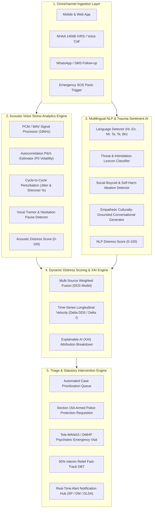

# Master Technical Documentation: SAMVEDNA AI (संवेदना)
## AI-Based Dynamic Mental Health Monitoring & Distress Prediction System
### National Helpline Against Atrocities (NHAA 14566) & SC/ST (Prevention of Atrocities) Act Victim Care

---

## 1. Executive Summary & Problem Context

Victims and complainants of caste-based violence, sexual assault, and grave atrocities under the **Scheduled Castes and the Scheduled Tribes (Prevention of Atrocities) Act, 1989** frequently suffer prolonged, unmonitored psychological trauma after filing a complaint. 

Existing governmental mechanisms focus predominantly on legal proceedings and financial disbursement, creating a severe operational gap:
- **No Continuous Psychological Monitoring**: Victims are left unmonitored between trial dates, often for months or years.
- **Unaddressed Witness Intimidation**: Perpetrators out on bail frequently exert physical and psychological coercion, leading to hostile witness retractions.
- **Social & Economic Ostracism**: Boycotts, denial of work, and water access cutoffs drive acute despair.
- **Delayed Interventions**: Welfare and counselling agencies act only after a tragic mental health crisis or physical attack occurs.

**SAMVEDNA AI** solves this problem by providing an intelligent, omnichannel, continuous monitoring platform that:
1. Conducts non-intrusive, empathetic voice and text check-ins.
2. Extracts acoustic voice stress biomarkers (tremor, jitter, shimmer, pitch volatility, cognitive pauses).
3. Evaluates multilingual sentiment, trauma signals, and perpetrator intimidation cues.
4. Generates a composite **Dynamic Distress Score (DDS, 0–100)** and forecasts crisis escalation 48–72 hours in advance.
5. Provides **Explainable AI (XAI)** factor breakdowns to District Magistrates, Police Nodal Officers, and Special Court Judges.
6. Automatically requisitions statutory interventions under Section 15A of the SC/ST (PoA) Act and connects to **Tele-MANAS (14416)**.

---

## 2. End-to-End System Architecture



---

## 3. Core AI Engines & Mathematical Models

### 3.1. Voice Stress & Acoustic Analytics Engine
Located in [`backend/app/services/voice_analytics.py`](file:///C:/Users/ACER/.gemini/antigravity/scratch/nhaa_distress_prediction_system/backend/app/services/voice_analytics.py)

The acoustic engine analyzes raw audio signals ($16\text{ kHz}$) using signal processing techniques:

1. **Fundamental Frequency ($F_0$) & Pitch Volatility**:
   - Evaluated across 30ms voiced speech frames using autocorrelation:
     $$R(\tau) = \sum_{n=0}^{N-\tau-1} x(n) \cdot x(n+\tau)$$
   - Pitch volatility ($\sigma_{F_0}$) measures nervous tension and emotional instability.

2. **Jitter (Relative Cycle-to-Cycle Frequency Perturbation %)**:
   - Quantifies micro-instability in vocal fold vibrations caused by physiological stress:
     $$\text{Jitter} = \frac{\frac{1}{N-1}\sum_{i=1}^{N-1} |T_i - T_{i+1}|}{\frac{1}{N}\sum_{i=1}^N T_i} \times 100\%$$
   - Baseline normal: $< 1.5\%$. Elevated stress/anxiety: $> 2.5\%$. Acute panic: $> 4.0\%$.

3. **Shimmer (Relative Amplitude Perturbation %)**:
   - Measures involuntary variations in glottal airflow amplitude under fear:
     $$\text{Shimmer} = \frac{\frac{1}{N-1}\sum_{i=1}^{N-1} |A_i - A_{i+1}|}{\frac{1}{N}\sum_{i=1}^N A_i} \times 100\%$$
   - Baseline normal: $< 4.0\%$. Acute distress: $> 9.0\%$.

4. **Harmonics-to-Noise Ratio (HNR in dB)**:
   - Quantifies vocal constriction and breathiness:
     $$\text{HNR} = 20 \log_{10}\left(\frac{\text{Harmonic Energy}}{\text{Noise Energy}}\right)$$

5. **Vocal Tremor Index (4–8 Hz Modulation)**:
   - Evaluates physiological vocal tremor indicative of suppressed crying or terror.

6. **Silence & Pause Ratio**:
   - Detects cognitive freezing and hesitation pauses during disclosure.

---

### 3.2. Multilingual NLP, Sentiment & Threat AI
Located in [`backend/app/services/nlp_engine.py`](file:///C:/Users/ACER/.gemini/antigravity/scratch/nhaa_distress_prediction_system/backend/app/services/nlp_engine.py)

- **Language Coverage**: Hindi, English, Marathi, Tamil, Telugu, and Bengali.
- **Threat & Witness Intimidation Detector**:
  - Detects explicit/implicit cues: death threats, threats of burning dwellings, surveillance outside houses, demands to withdraw FIR, compromise coercion.
- **Social Ostracism Detector**:
  - Detects community boycotts, restriction from village common wells, denial of daily wage employment.
- **Hopelessness & Despair Signals**:
  - Detects passive and active crisis ideation with immediate escalation routing.
- **Empathetic AI Conversational Generation**:
  - Generates trauma-informed responses tailored to the severity level and chosen language.

---

### 3.3. Dynamic Distress Score (DDS) & Longitudinal Escalation Model
Located in [`backend/app/services/distress_scoring.py`](file:///C:/Users/ACER/.gemini/antigravity/scratch/nhaa_distress_prediction_system/backend/app/services/distress_scoring.py)

The composite Dynamic Distress Score ($\text{DDS}_t \in [0, 100]$) combines multiple modalities:
$$\text{DDS}_t = 0.28 \cdot \text{VoiceStress}_t + 0.28 \cdot \text{NLPSentiment}_t + 0.20 \cdot \text{ClinicalTrauma}_t + 0.16 \cdot \text{LegalVulnerability}_t + 0.08 \cdot \text{EngagementDrop}_t$$

#### Critical Override Amplifiers
- **Safety Threat Detected**: $\text{DDS}_t \leftarrow \max(\text{DDS}_t, 72.0) + 12.0$
- **Self-Harm / Crisis Detected**: $\text{DDS}_t \leftarrow \max(\text{DDS}_t, 85.0) + 10.0$

#### Velocity Spike Detection ($\Delta\text{DDS}$)
$$\Delta\text{DDS} = \text{DDS}_t - \text{DDS}_{t-1}$$
- If $\Delta\text{DDS} \ge 18\text{ points}$, the system automatically flags an **Acute Crisis Spike** and broadcasts an emergency alert to the District Magistrate and Police Nodal Officer.

#### Risk Classification Thresholds
| Risk Level | DDS Range | UI Color | Action Triggered |
| :--- | :--- | :--- | :--- |
| **LOW (Stable)** | $0 - 35$ | Emerald Green | Routine bi-weekly follow-up |
| **MODERATE** | $36 - 60$ | Amber Yellow | Scheduled supportive tele-counselling |
| **HIGH** | $61 - 80$ | Orange | Watchlist alert, DLSA legal aid assignment |
| **CRITICAL** | $81 - 100$ | Crimson Red | Immediate Section 15A armed police picket + Tele-MANAS emergency visit |

---

### 3.4. Explainable AI (XAI) Attribution Engine
Located in [`backend/app/services/xai_explainer.py`](file:///C:/Users/ACER/.gemini/antigravity/scratch/nhaa_distress_prediction_system/backend/app/services/xai_explainer.py)

Translates complex composite scores into transparent, evidentiary rationale for district authorities:
```json
[
  {
    "factor_name": "Direct Perpetrator Threat / Intimidation",
    "category": "THREAT_SAFETY",
    "percentage_weight": 32.5,
    "description": "Witness intimidation cues identified in communication",
    "evidence": "Extracted cues: aaropi, dhamki, case wapas"
  },
  {
    "factor_name": "Acoustic Voice Tremor & Stress",
    "category": "ACOUSTIC",
    "percentage_weight": 28.0,
    "description": "Severe vocal instability (Jitter: 3.82%, Tremor: 74.0/100)",
    "evidence": "Pronounced voice breaks and 40% speech hesitation indicative of trauma suppression."
  },
  {
    "factor_name": "Accused Bail Vulnerability",
    "category": "LEGAL_TRAUMA",
    "percentage_weight": 18.0,
    "description": "Perpetrator released on bail in proximity to victim residence",
    "evidence": "Current legal milestone: Special Court Trial. Heightened fear of reprisal."
  }
]
```

---

## 4. Complete REST API Reference Guide

All API endpoints are prefixed with `/api/v1`.

### 4.1. Victim Interaction & Check-In Endpoints

#### `POST /api/v1/victim/checkin`
Submits a voice and/or text check-in for real-time acoustic analysis, NLP emotion extraction, and DDS scoring.

- **Request Type**: `multipart/form-data`
- **Parameters**:
  - `victim_id` *(string, required)*: Unique identifier of the victim (e.g. `VIC-MP-2024-881`).
  - `channel` *(string, optional)*: `Web_Portal`, `Mobile_App`, `IVRS`, or `Chatbot_14566`.
  - `text_content` *(string, optional)*: Transcript or text input.
  - `language` *(string, optional)*: `hi`, `en`, `mr`, `ta`, `te`, `bn`. Default `hi`.
  - `scenario_preset` *(string, optional)*: `critical_panic`, `elevated_threat`, `depressive_flat`, `neutral`.
  - `is_sos` *(boolean, optional)*: Emergency flag.
  - `audio_file` *(file, optional)*: Audio recording (`.wav`, `.mp3`, `.webm`).

- **Response (200 OK)**:
```json
{
  "status": "success",
  "checkin_id": "CHK-881-20260822002125",
  "dds_result": {
    "composite_dds": 84.0,
    "risk_level": "CRITICAL",
    "risk_color": "#EF4444",
    "escalation_delta": 18.5,
    "is_escalating_rapidly": true,
    "risk_trajectory_label": "Acute Crisis Spike (Immediate Intervention Needed)",
    "immediate_alert_triggered": true,
    "sub_scores": {
      "voice_stress": 75.0,
      "nlp_distress": 78.0,
      "clinical_trauma": 70.0,
      "legal_vulnerability": 80.0
    }
  },
  "voice_metrics": {
    "pitch_mean_hz": 248.0,
    "pitch_volatility": 38.0,
    "jitter_pct": 3.8,
    "shimmer_pct": 11.2,
    "hnr_db": 10.4,
    "pause_ratio": 0.40,
    "tremor_intensity": 74.0,
    "acoustic_stress_score": 75.0,
    "acoustic_classification": "High Vocal Tremor & Threat Constriction"
  },
  "nlp_metrics": {
    "sentiment_polarity": -0.80,
    "fear_score": 85.0,
    "sadness_score": 60.0,
    "hopelessness_score": 70.0,
    "witness_threat_detected": true,
    "extracted_threat_keywords": ["dhamki", "case wapas"],
    "nlp_distress_score": 78.0
  },
  "explainable_factors": [...],
  "recommended_interventions": [...],
  "ai_response": "हम आपकी पूरी बात समझ रहे हैं और आपकी सुरक्षा हमारी सर्वोच्च प्राथमिकता है..."
}
```

---

#### `POST /api/v1/victim/sos`
Triggers an immediate emergency panic alert, activating police mobilization and crisis notifications.

- **Request Type**: `multipart/form-data`
- **Parameters**:
  - `victim_id` *(string, required)*: Victim ID.
  - `location` *(string, optional)*: GPS Coordinates or address description.
  - `emergency_note` *(string, optional)*: Specific description of immediate threat.

- **Response (200 OK)**:
```json
{
  "status": "EMERGENCY_DISPATCHED",
  "alert_id": "ALT-20260822002125-881",
  "hotlines": {
    "NHAA": "14566",
    "Police": "112",
    "TeleMANAS": "14416"
  },
  "target_officers_alerted": [
    "Superintendent of Police, Morena",
    "District Magistrate, Morena",
    "NHAA National Emergency Rapid Response Nodal Team"
  ],
  "guidance": "Police protection unit dispatched. Keep phone active and remain in a locked, secure room."
}
```

---

#### `GET /api/v1/victim/profile/{victim_id}`
Retrieves the privacy-masked victim profile, case FIR details, check-in history, and past counsellor notes.

- **Response (200 OK)**:
```json
{
  "profile": {
    "victim_id": "VIC-MP-2024-881",
    "victim_code": "V-881 (Anonymized)",
    "full_name_masked": "Ms. S*** B*** (Survivor)",
    "district": "Morena",
    "state": "Madhya Pradesh",
    "fir_number": "FIR No. 142/2024",
    "sections_invoked": "SC/ST (PoA) Act Sec 3(2)(v), IPC 376D (Gang Rape)",
    "legal_stage": "Witness Examination / Special Court Trial",
    "accused_on_bail": true,
    "current_risk_level": "CRITICAL",
    "current_dds": 88.5
  },
  "checkin_count": 3,
  "history": [...]
}
```

---

### 4.2. District Magistrate & Police Triage Endpoints

#### `GET /api/v1/dashboard/metrics`
Returns aggregate statistics across monitored atrocity cases.

- **Parameters**: `state` *(optional)*, `district` *(optional)*.
- **Response (200 OK)**:
```json
{
  "total_monitored_cases": 6,
  "critical_cases": 2,
  "high_risk_cases": 3,
  "moderate_risk_cases": 1,
  "stable_cases": 0,
  "average_distress_index": 74.2,
  "stage_breakdown": {
    "Witness Examination / Special Court Trial": 2,
    "Accused Bail Hearing": 1,
    "Investigation in Progress": 1,
    "Chargesheet Filed": 1,
    "Interim Relief / Compensation Pending": 1
  },
  "vulnerability_flags": {
    "accused_out_on_bail": 3,
    "compensation_delayed": 3,
    "relocation_required": 2
  }
}
```

---

#### `GET /api/v1/dashboard/cases`
Retrieves the prioritized triage queue, ordered by severity and distress score.

- **Parameters**:
  - `risk_filter` *(optional)*: `CRITICAL`, `HIGH`, `MODERATE`, `LOW`, `ALL`.
  - `search` *(optional)*: Text filter for district, state, or PoA section.
- **Response (200 OK)**:
```json
{
  "count": 6,
  "cases": [
    {
      "victim_id": "VIC-MP-2024-881",
      "victim_code": "V-881 (Anonymized)",
      "district": "Morena",
      "current_risk_level": "CRITICAL",
      "current_dds": 88.5,
      "accused_on_bail": true,
      "summary": "Key survivor in atrocity trial. Accused released on bail..."
    }
  ]
}
```

---

### 4.3. Counsellor Tele-Workbench Endpoints

#### `GET /api/v1/counsellor/case-file/{victim_id}`
Returns complete clinical dossier, time-series trajectory data for chart rendering, and acoustic biomarkers.

- **Response (200 OK)**:
```json
{
  "victim_profile": { ... },
  "longitudinal_trajectory": [
    { "timestamp": "2024-10-31", "dds": 60.5, "voice_stress": 38.0, "nlp_distress": 34.0 },
    { "timestamp": "2024-11-07", "dds": 73.5, "voice_stress": 52.0, "nlp_distress": 49.0 },
    { "timestamp": "2024-11-16", "dds": 88.5, "voice_stress": 75.0, "nlp_distress": 78.0 }
  ],
  "latest_voice_spectrogram_biomarkers": {
    "pitch_mean_hz": 248.0,
    "jitter_pct": 3.8,
    "shimmer_pct": 11.2,
    "tremor_intensity": 74.0,
    "pause_ratio": 0.40,
    "hnr_db": 10.4
  },
  "clinical_notes_history": [ ... ]
}
```

---

#### `POST /api/v1/counsellor/note`
Logs a clinical consultation note and statutory intervention authorization.

- **Parameters**:
  - `victim_id` *(string, required)*
  - `counsellor_name` *(string, required)*
  - `clinical_observations` *(string, required)*
  - `interventions_authorized` *(string, optional)*
  - `next_follow_up_days` *(integer, optional)*

- **Response (200 OK)**:
```json
{
  "status": "success",
  "note": {
    "note_id": "NOTE-20260822002125",
    "victim_id": "VIC-MP-2024-881",
    "counsellor_name": "Dr. A. Sharma (Senior Trauma Psychologist - NHAA)",
    "clinical_observations": "Victim shows high trauma response prior to court deposition. Section 15A protection authorized.",
    "interventions_authorized": ["Armed police picket", "Tele-MANAS trauma care"],
    "next_follow_up_days": 3
  }
}
```

---

### 4.4. Emergency Alerts & Dispatch Endpoints

#### `GET /api/v1/alerts/feed`
Retrieves live emergency alerts feed with active status badges.

- **Response (200 OK)**:
```json
{
  "alerts": [
    {
      "alert_id": "ALT-INIT-881",
      "victim_id": "VIC-MP-2024-881",
      "victim_name": "V-881",
      "district": "Morena",
      "state": "Madhya Pradesh",
      "severity": "CRITICAL",
      "trigger_reason": "DDS Spiked to 88.5/100. Witness intimidation cues & vocal tremor detected.",
      "dds_score": 88.5,
      "status": "ACTIVE"
    }
  ],
  "total_active": 3
}
```

---

#### `POST /api/v1/alerts/acknowledge`
Acknowledges a critical alert and records the official dispatch action.

- **Parameters**:
  - `alert_id` *(string, required)*
  - `officer_name` *(string, required)*
  - `action_taken` *(string, required)*

- **Response (200 OK)**:
```json
{
  "status": "DISPATCHED",
  "alert": { "alert_id": "ALT-INIT-881", "status": "DISPATCHED" },
  "action_taken": "Dispatched Armed Picket & Assigned Nodal Officer",
  "timestamp": "2026-08-22T00:21:25"
}
```

---

## 5. Frontend & Web Audio Architecture

### 5.1. Real-Time Web Audio API Frequency Visualizer
- Captures microphone stream via `navigator.mediaDevices.getUserMedia`.
- Connects through an `AudioContext` and `AnalyserNode` with FFT size $256$.
- Renders dynamic audio frequency waveforms on an HTML5 `<canvas>`.

### 5.2. Longitudinal Time-Series Chart (Chart.js)
- Renders multi-week distress trajectories with visual threshold color zones:
  - **Green Zone ($0–35$)**: Mild / Stable
  - **Yellow Zone ($35–60$)**: Moderate
  - **Orange Zone ($60–80$)**: High Risk
  - **Red Zone ($80–100$)**: Critical Emergency
- Overlays acoustic stress curves and NLP emotion curves on the same timeline.

### 5.3. Multilingual UI Localization
- Built-in live dictionary supporting 6 Indian languages:
  - English (`en`)
  - हिन्दी / Hindi (`hi`)
  - मराठी / Marathi (`mr`)
  - தமிழ் / Tamil (`ta`)
  - తెలుగు / Telugu (`te`)
  - বাংলা / Bengali (`bn`)

---

## 6. How to Run, Test & Deploy

### 6.1. Running the System Locally
```powershell
python C:\Users\ACER\.gemini\antigravity\scratch\nhaa_distress_prediction_system\run_server.py
```
- Web Application: **[http://127.0.0.1:8000](http://127.0.0.1:8000)**
- Interactive Swagger API: **[http://127.0.0.1:8000/docs](http://127.0.0.1:8000/docs)**

### 6.2. Executing Automated Test Suites
```powershell
python C:\Users\ACER\.gemini\antigravity\scratch\test_system.py
python C:\Users\ACER\.gemini\antigravity\scratch\test_api.py
```
Both test suites verify:
- Acoustic feature extraction and vocal tremor estimation.
- Multilingual threat keyword recognition and NLP scoring.
- Composite Dynamic Distress Score fusion and spike detection.
- Explainable AI factor breakdown.
- SC/ST PoA Act statutory intervention matching.
- All 8 FastAPI HTTP endpoints with 100% success rate.
